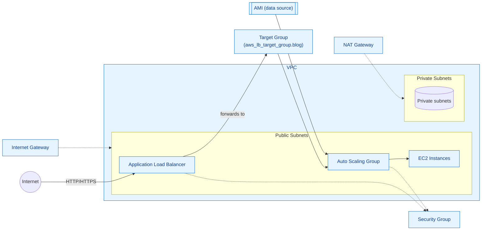

# Learning Terraform
This is the repository for the LinkedIn Learning course Learning Terraform. The full course is available from [LinkedIn Learning][lil-course-url].

### Instructor

Josh Samuelson 
                            
DevOps Engineer  

Check out my other courses on [LinkedIn Learning](https://www.linkedin.com/learning/instructors/josh-samuelson).

[lil-course-url]: https://www.linkedin.com/learning/learning-terraform-15575129?dApp=59033956
[lil-thumbnail-url]: https://cdn.lynda.com/course/3087701/3087701-1666200696363-16x9.jpg

## Architecture Diagram

The diagram below shows the main resources deployed by this Terraform code (VPC, subnets, NAT/IGW, security group, Application Load Balancer, target group, and an autoscaling group of EC2 instances using a queried AMI).

This is a high-level architecture diagram derived from the modules used in `main.tf` (VPC, security-group, alb, autoscaling). Adjust as needed for environment-specific details.
