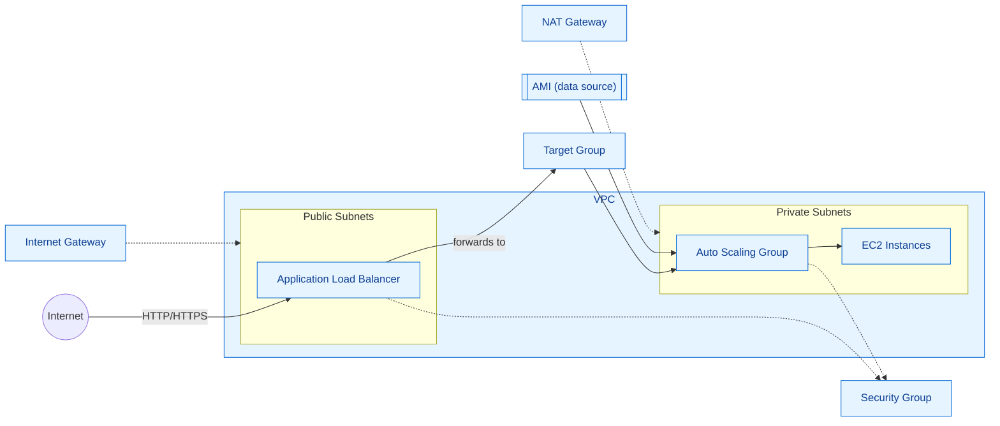

This is my practice branch... copy maynot be complete.

# Learning Terraform
This is the repository for the LinkedIn Learning course Learning Terraform. The full course is available from [LinkedIn Learning][lil-course-url].

Terraform is a DevOps tool for declarative infrastructure—infrastructure as code. It simplifies and accelerates the configuration of cloud-based environments. In this course, instructor Josh Samuelson shows how to use Terraform to configure infrastructure and manage resources with Amazon Web Services (AWS). After demonstrating how to set up AWS for Terraform, Josh covers how Terraform manages your infrastructure, as well as how to use core Terraform commands. He also delves into more advanced topics, including how to leverage code modules from the Terraform registry and how to create your own modules. Upon wrapping up this course, you'll have the knowledge you need to efficiently define and manage infrastructure with this powerful tool.

_See the readme file in the main branch for updated instructions and information._
## Instructions
This repository has branches for each of the videos in the course. You can use the branch pop up menu in github to switch to a specific branch and take a look at the course at that stage, or you can add `/tree/BRANCH_NAME` to the URL to go to the branch you want to access.

## Branches
The branches are structured to correspond to the videos in the course. The naming convention is `CHAPTER#_MOVIE#`. As an example, the branch named `02_03` corresponds to the second chapter and the third video in that chapter. The code is built sequentally so each branch contains the completed code for that particular video and the starting code can be found in the previous video's branch.

The `main` branch contains the starting code for the course and the `final` branch contains the completed code.

### Instructor

Josh Samuelson 
                            
DevOps Engineer

                            

Check out my other courses on [LinkedIn Learning](https://www.linkedin.com/learning/instructors/josh-samuelson).

[lil-course-url]: https://www.linkedin.com/learning/learning-terraform-15575129?dApp=59033956
[lil-thumbnail-url]: https://cdn.lynda.com/course/3087701/3087701-1666200696363-16x9.jpg

## Architecture Diagram

The diagram below shows the main resources deployed by this Terraform code (VPC, subnets, NAT/IGW, security group, Application Load Balancer, target group, and an autoscaling group of EC2 instances using a queried AMI).

This is a high-level architecture diagram derived from the modules used in `main.tf` (VPC, security-group, alb, autoscaling). Adjust as needed for environment-specific details.
